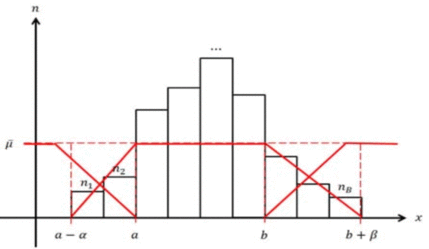

# Fuzzy Computer Vision Toolbox

Release on July 05, 2017

# Description
A toolbox for Fuzzy Computer Vision. This is part of the tutorial that is going to be presented in FUZZ-IEEE 2017, Naples, Italy, as well as the implementation of our TFS work with titled [Scene Image is Non-Mutually Exclusive - A Fuzzy Qualitative Scene Understanding](http://cs-chan.com/doc/TFS2014.pdf). There are a few prerequisites before you start this practical, please ensure you have installed the following toolboxes or libraries in your computer. You may follow the steps below for installation:

1.	Install Python (Recommend Anaconda Python 2.7 version)
     - Download from: https://www.continuum.io/downloads

2.	Install opencv library (version 2.4.x.x)
    1.	  Download opencv library from: http://opencv.org/releases.html
    2.	  Double-click to extract the opencv.
    3.	Go to “opencv/build/python/2.7/x64 folder.”
    4.	  Copy cv2.pyd to your python directory in the “lib/site-packages”.

3.	Install scikit-image package.
    1.	Open anaconda prompt
    2.	Type “pip install scikit-image”
    3.	Web reference: http://scikit-image.org/

4.	Install scikit-learn package. 
    1.	Open anaconda prompt
    2.	Type “pip install scikit-learn”
    3.	Web reference: http://scikit-learn.org/stable/
    
    
    
## Citation 
If you find this code useful for your research, please cite
```sh
@article{LimRC14,
  author    = {Chern Hong Lim and Anhar Risnumawan and Chee Seng Chan},
  title     = {Scene Image is Non-Mutually Exclusive - {A} Fuzzy Qualitative Scene Understanding},
  journal   = {{IEEE} Trans. Fuzzy Systems},
  volume    = {22},
  number    = {6},
  pages     = {1541--1556},
  year      = {2014},
  url       = {https://doi.org/10.1109/TFUZZ.2014.2298233},
  doi       = {10.1109/TFUZZ.2014.2298233},
}
```

# Feedback
Suggestions and opinions of this work (both positive and negative) are greatly welcome. Please contact the authors by sending email to Chern Hong Lim at `chlim at acd.tarc.edu.my` or Chee Seng Chan at `cs.chan at um.edu.my`

# License
BSD-3, see LICENSE file for details.
